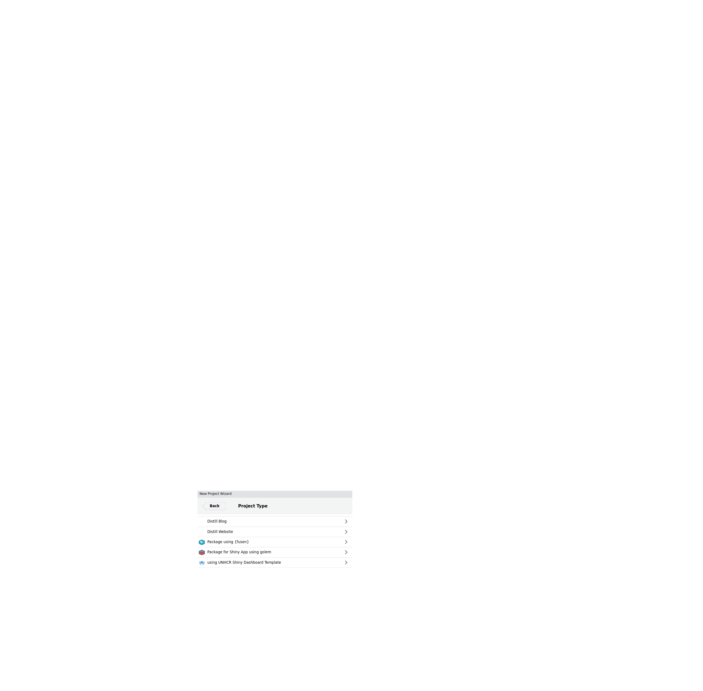
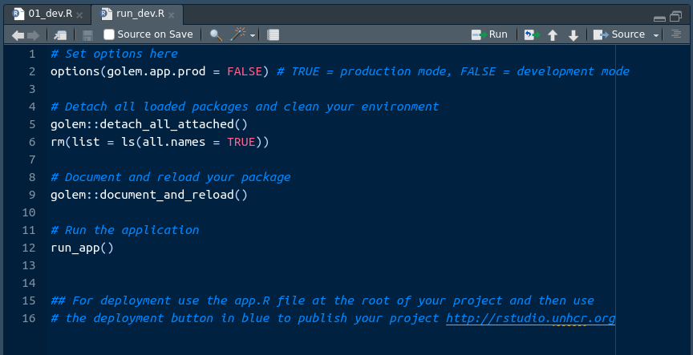

# {graveler}

> Build standardized, branded, modular dashboards to deploy on [UNHCR Posit Connect Server](http://rstudio.unhcr.org)

## Overview

This [{graveler} fork](https://github.com/ghcarlalan/graveler) is an __Rstudio Project Template__ and a wrapper for [{golem}](https://engineering-shiny.org/), [{shinyDashboard}](https://rstudio.github.io/shinydashboard/index.html), [{fusen}](https://thinkr-open.github.io/fusen), and [{unhcrshiny}](https://edouard-legoupil.github.io/unhcrshiny/) packages. 

At a high level, {golem} turns your shiny dashboards into a package framework and allows you to build and deploy them almost exactly as you would for an R package. This allows for better documentation, testing, robustness, etc. {graveler} abstracts away its technical side and set defaults for the development workflow of UNHCR dashboards.

You shall then be able to create an initial working dashboard in a few minutes!

## Dashboard in Shiny

Developing dashboards in shiny, rather than with a _"point and click"_  software, requires some familiarity with R programming but also comes with numerous advantages: 

 *  __Customizability within standards__: Shiny offers a high level of flexibility and customization, allowing you to design interactive dashboards with tailored visualizations, layouts, and user interfaces (including for the instance [humanitarian icons](https://fontawesome.com/icons/categories/humanitarian)). This comes also with amazing plotting capacity leveraging [ggplot2](https://ggplot2.tidyverse.org/). At the same time, as soon as the standard css (with [{unhcrshiny}](https://edouard-legoupil.github.io/unhcrshiny/)) is used, the look and feel will remain fully consistent.
 
 *  __Seamless Integration with R__: Shiny allows you to leverage the power and flexibility of the R language and its extensive ecosystem of packages for data analysis, visualization, and statistical modeling.

  *  __Responsiveness on mobile devices__: Shiny Dashboard are built per default with bootstrap, allowing for User Interface Responsiveness, meaning the resulting product will be legible on smartphones for senior managers in a hurry.
 
 *  __Advanced Analytics__: With R's extensive statistical capabilities, Shiny enables the integration of complex statistical models and advanced analytics directly into your dashboard.
 
 *  __Reproducibility and Transparency__: Since Shiny dashboards are built using R code, they are inherently reproducible and transparent, making it easier to share and validate analysis methods and results.
 
  *  __Publication and Maintenance__: UNHCR has already invested in a [Rstudio Connect server](http://rstudio.unhr.org) infrastructure, which is ready to be leveraged. There are even ways to keep your dashboard behind authentication if need arise. As Shiny Dashboard are based on scripts, there are easier to maintain and monitor over time, as you can keep them under version control in github.
 
 *  __Open-Source Community__: Shiny benefits from a large and active open-source community, which provides a wealth of resources, packages, and support.

## Why Bother with {graveler}?

As any development team grows larger, it is important to standardize code to avoid the dreaded event in which you are handed a project that is coded so differently from your usual workflow that you either have to spend hours refactoring and / or rebuilding from scratch. Additionally, {shiny} itself can be complicated to spin up at times for developers who are not familiar with its syntax. 

__{graveler} allows you to create standard, scalable and documented code so you can focus on actual dashboard element creation instead of spending time getting the various back-end pieces to talk to each other.__

> Note that this package is not like {shinyWidgets} or other shiny element packages. This is a __dashboard skeleton creator__ that allows you and your team to all start from the same page (some might say fluidPage) so your dashboards all have the same feel, layout, and backend creation.

## Get Started

You may also review the [slideck](https://unhcrverse.github.io/unhcrverse/learn/11.Simplify_with_companionApp.html)

### Package Installation

If you are on windows, you will need to install [Rtools](https://cran.r-project.org/bin/windows/Rtools/) on the top of [R](https://cran.rstudio.com/) [Rstudio](https://posit.co/download/rstudio-desktop/)

Then you can paste the following to install the package:

```
install.packages("pak")
pak::pkg_install("edouard-legoupil/graveler")
```

Once the package is installed on your Rstudio, follow the steps below:

### Project Creation

To create a {graveler} dashboard:

1.  Click `New Project`

2.  Select `New Directory`

3.  Select `using UNHCR Shiny Dashboard Template`



4.  Fill out the form, ensuring that the `Directory Name` and `Pkg Name` both match and are written in camelCase (failing to do so will break your dashboard immediately)


5.  Make sure to set the proper sub directory within your computer file system

6.  Click `Create Project`


This will make a new directory on your machine with the following structure:

```
   .
   ├── app.R # script used to launch the app for deployment
   ├── .Rbuildignore # ignores systems files not needed for builds
   ├── .git # ignores files for git version control
   ├── _pkgdown.yml # template for documentation website
   ├── .github # folders with issue templates for bug report & feature request
   ├── DESCRIPTION # where libraries are installed for your package
   ├── dev/
   │   ├── 01_dev.R # package dependencies and system file creations
   │   └──  run_dev.R # build, document, and run the shiny dashboard
   ├── inst/
   │   └── app/
   │       └── www/ # standard shiny extra file subfolder
   │           └── favicon.ico # unhcr favicon
   ├── man/ # .Rd system files for functions generated by R
   └── R/
       ├── app_server.R # callModules server side here
       ├── app_ui.R # combines header, sidebar, body files
       ├── body.R # organizes UI layouts - call in modules ui side there
       ├── globals.R # specific environment variables for the project
       ├── header.R # display name and other shinydashboardPlus features
       ├── mod_home.R  # first module for your splash page    
       ├── run_app.R # main function to start the shiny app         
       └── sidebar.R # tabs and their icons - call in modules menu there
```

### Initialization of the app

When you load up the new project, you will have two files open: `01_dev.R` and `run_dev`.

#### 01_dev

The first file sets up the dependencies for deployment. If you check the `DESCRIPTION` file, it will have no imports on initialization. When you run this file, it attaches all of your libraries to the package so that the server you publish to can know what to install and run.

These include the libraries you need to run your dashboard, a golem.config system file, an app.R file to deploy on RStudio Connect, and a manifest file to use git backed content within RStudio Connect. You can adjust these to fit your workflow.

At the end of the file, you will navigate to the run_dev.R file.


#### run_dev

Once your dependencies and system files are in place, you can run all code in the `run_dev.R` file. 



This should successfully run and load your (currently empty) shiny dashboard! 

> **Note:** When you run the line `run_dev.R`, you will be prompted in your console to create a golem-config.yml file. Enter 1 when prompted to create the necessary backend files required for {golem} to run your dashboard package.


In the span of a minute you have already made a reproducible and fully functional framework!


If you are familiar with building R packages, this file is the equivalent of running the `Install and Restart` option: it creates your `NAMESPACE`, documents .Rd files, and temporarily installs it locally.

### Back office

To build a robust app, it is key to separate the back-office (basically an R package which act as _utilities functions_) from the user interaction management (the ShinyApp). 

#### Set up utilities functions for your application

 {golem} [suggests you functionalize your code](https://engineering-shiny.org/build-app-golem.html?q=fct#submodules-and-utility-functions) by creating dedicated functions that works independently from the interface. Such utilities could include:  
 
  * connecting to an API using token (that would be stored as environment variables) 

  * Data tidying and cleaning  

  * Building a chart  
 
Using this {graveler} fork, this will be done through the creation of a dedicated {fusen} notebook where you should prefix all your function with `fct_` to distinguish from the modules that comes with `fct_`. Using {fusen} allows for quick peer review, robust documentation and easy debugging (as you can always understand if an issue arise from the interface or from the functions below it). When you create a [graveler] project, a default {fusen} notebook is created under `"dev/function_documentation.Rmd"` which comes with a series of default function with key dashboard charts.

> If you need to add a new library, simply make sure to systematically reference them within your `@import` or `@importFrom`, within your function documentation. make sure to `attachment::att_amend_desc()` so the library are referenced in your NAMESPACE

Your goal is to to get :

> 0 errors ✔ | 0 warnings ✔ | 0 notes ✔

Please check the examples to better understand how this works.

#### Token and authentication

For evident data protection reason, it is key not to include any user name, password or authentication. The right way to do this is to use environment variables. 

This will be the case for instance if you pull data from [RIDL](https://edouard-legoupil.github.io/riddle/#install-and-configure-authentication-token) - 

Below is an example to access data from ActivityInfo using the [dedicaed R package](https://www.activityinfo.org/support/docs/R/index.html)

```
# set up token as environement variable - aka save within your hidden file .Renviron
token <- "activityinfotoken.."
print(Sys.setenv(ACTIVITYINFOTOKEN = token))   
Sys.getenv("ACTIVITYINFOTOKEN")
rm(token)
  
## Now we can login using this environement variable
activityinfo::activityInfoToken(Sys.getenv("ACTIVITYINFOTOKEN"),
                                prompt = FALSE)
```

When deploying on Rstudio Connect, you will need to deploy a first time,then go to the settings of your deployed project and set up there this same environment variable. See [more info here](https://posit.co/wp-content/themes/Posit/public/markdown-blogs/rstudio-connect-v1-5-14/index.html#secure-environment-variables).


### Modularization

If you are unfamiliar, modularization splits your dashboard into *n* files where *n* is the number of sidebar tabs / modules you want to make that each have their own UI and server namespaces. This allows you to independently load each module's code (if one breaks, the rest will still work) and reuse IDs for UI elements (you can give different plotOuputs a generic name like "chart" across two different modules).

By default the template comes with an initial `home` module where the first tab with the home page is included.

#### Creation

When inside a `{graveler}` project, running the function `level_up(name = "foo")` will add a new module - called `"foo"` - to your dashboard :

```
   .
   ├── R/
   │   ├── app_server.R
   │   ├── app_ui.R
   │   ├── body.R
   │   ├── header.R
   │   ├── mod_foo.R                    <<<<< HERE
   │   ├── mod_home.R            
   │   ├── run_app.R
   │   └── sidebar.R
   ├── man/
   ├── inst/
   ├── dev/
   ├── DESCRIPTION
   ├── foo.Rproj
   ├── .Rbuildignore
   └── NAMESPACE
```


You place your UI and server code in the `mod_` file, that reflect away repeatable data manipulation or plotting functions created through your {fusen} notebook. 

In general, this helps keep your module code short and tidy, and allows you to put documentation for your functions just like a package.


#### Connection between modules and dashboard

`level_up` might create your module, but you still need to tell your dashboard to include and run this module. To do so, there are three lines at the bottom you copy and paste into their appropriate files: `body.R`, `app_server.R`, and `sidebar.R` (un commented, of course).

The body and sidebar lines need to be separated with commas if you have multiple modules, but the `app_server` will be individual lines like so:


Once that is done, your modules should appear on the left. All that is left to do is to insert your actual dashboard elements.


#### Communication between modules

Typically communication between modules will be required if you want to use filters across modules.

This imply to set a specific object `reactivalues` (called per default `AppReactiveValue`) that will be consumed by all your modules.

### Customization
 

The implementation of the brand within your plots should be done with [unhcrthemes](https://vidonne.github.io/unhcrthemes/). 


## Deployment

Once the `run_dev.R` file runs and your dashboard is error free, you can go for deployment. 

Get in touch with __UNHCR Global Data Service__ to obtain a Rstudio Connect license.

For publication, you have two main options. 

### Option 1: Publish via Button


In order to deploy your application, the basic file have been created. 

Run the `app.R` file to launch your application locally and then click on the blue: "`publish button`"" in the top right.


 It will gather your dependencies, ensure the server has them installed, and then your dashboard will be view-able on RStudio Connect.
[More info on deployement here](https://data-viz.it.wisc.edu/__docs__/admin/appendix/deployment-guide/)

### Option 2:  Publish via Github

As a general approach, it is a good practice to keep a copy of your dashboard in github.

> Be cautious with password and token - do not upload this in github. Password and token should rather be called as envrionement variables and set up separately after deployement in rstudio Connect


While more involved then simply clicking a button, git backed content will ensure your published works will align with your team's codebase and allow others to collaborate easier. Earlier, we made a `manifest.json` file at the end of the `01_dev.R` file. This creates an "image" that RStudio looks for and reproduces from github directly.

To publish for the first time, you push your code to whichever repo and branch on github, then in RStudio Connect you click its blue, publish button. You then navigate to the repo and branch you just pushed to, find the manifest file. Just like before, it will gather your dependencies from the manifest, ensure the server has them installed, and then your dashboard will be view-able on RStudio Connect.

To republish changes in the future, you simply merge your code to github and the file will automatically reflect those changes when it sees them.

### Good practices when publishing

 * Beware of token and password - see above on the usage of environment variable 
 
 * Favor publication from github as much as possible. Build and publish your package documentation on github with `pkgdown::build_site()`   
 
 * Share publication access rights with colleagues so that there's a back up plan to update the app if needed  
 
 * Once the application is published on the Posit Connect server, document the name of the github repo for your app within Rstudio Connect metadata and use a specific URL before disseminating the app 
 
 * Do not hesitate to reach out to me for peer review! :)
 
## Examples 

Please see the tutorials in the [package vignette](articles/learn_from_examples.html).

Other examples includes:  

 * [ActivtityInfoQuality](https://edouard-legoupil.github.io/ActivtityInfoQuality/) 
 * [rmsSampling](https://unhcr-americas.github.io/rmsSampling/)
 * [XlsFormUtil](https://unhcr-americas.github.io/XlsFormUtil/)
 * [HighFrequencyChecks](https://edouard-legoupil.github.io/HighFrequencyChecks/)
 * [kobocruncher](https://edouard-legoupil.github.io/kobocruncher/)
 * [unhcrdatapackage](https://github.com/Edouard-Legoupil/unhcrdatapackage) 

## Acknowledgement

Thanks to [Alan Carlson](https://github.com/alancarlson) for the initial idea on which the package is built from.
Thanks to [ThinkR](https://github.com/ThinkR-open/) for the packages on which this framework is built from.